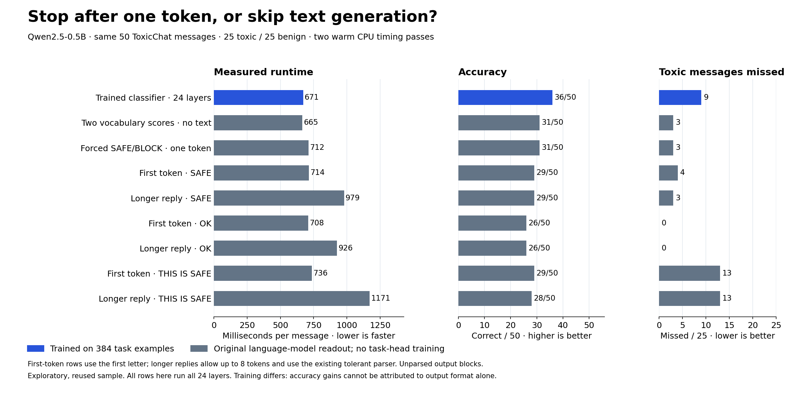

# One output token versus a trained classifier

[Website comparison](../output-results.html) · [All decision approaches](../decision-results.html)

This compares actual execution on the same 50 previously inspected [ToxicChat](https://huggingface.co/datasets/lmsys/toxic-chat) messages, with 25 toxic and 25 benign examples. All output-path rows use the same Qwen2.5-0.5B weights and run all 24 transformer blocks. The trained classifier has additional supervision on 384 separate examples; the language-model rows do not. This is an exploratory comparison, not a production moderation validation.

| Method | Correct / 50 | Toxic missed / 25 | Benign blocked / 25 | Unparsed / 50 | Mean ms/message | Mean output tokens |
|---|---:|---:|---:|---:|---:|---:|
| Trained classifier · 24 layers | 36 | 9 | 5 | 0 | 671.2 | 0.00 |
| Two vocabulary scores · no text | 31 | 3 | 16 | 0 | 664.9 | 0.00 |
| Forced SAFE/BLOCK · one token | 31 | 3 | 16 | 0 | 712.2 | 1.00 |
| First token · SAFE | 29 | 4 | 17 | 4 | 714.2 | 1.00 |
| Longer reply · SAFE | 29 | 3 | 18 | 6 | 979.3 | 2.72 |
| First token · OK | 26 | 0 | 24 | 2 | 708.3 | 1.00 |
| Longer reply · OK | 26 | 0 | 24 | 2 | 925.6 | 2.24 |
| First token · THIS IS SAFE | 29 | 13 | 8 | 3 | 736.5 | 1.00 |
| Longer reply · THIS IS SAFE | 28 | 13 | 9 | 4 | 1171.4 | 3.66 |

## What the output labels mean

- **Trained classifier:** reads the final 896-number hidden state with a trained linear 896-to-2 head. No vocabulary projection, output tokens or text parsing.
- **Two vocabulary scores:** uses only the original SAFE and BLOCK output-weight rows. No training, full-vocabulary projection or text generation. This is different from our browser direct-score implementation, which computes the full vocabulary projection.
- **Forced one token:** normal generation API with output restricted to SAFE or BLOCK. It computes the vocabulary projection, chooses one token and stops. Its decisions matched the two-row numerical path on every example and repeat.
- **First token:** unrestricted greedy generation stops after one token. The parser looks only at its first non-whitespace character: S, O or T means allow under that particular prompt; B means block. Unrecognized output blocks. This deliberately tests the proposed shortcut; it is not a reliable general natural-language parser.
- **Longer reply:** unrestricted greedy generation, natural EOS stopping, capped at eight tokens. Uses the existing enhanced parser, with the same blocking fallback. Exact and supplied-parser results are also retained.

SAFE, OK and BLOCK each occupy one token in this tokenizer. A model emits tokens rather than individual letters, so the first letter does not arrive earlier than the rest of that token. The first token comes from the input pass; subsequent output tokens require additional cached transformer passes. A classifier avoids the language vocabulary readout, but still needs its chosen input-processing layers.

THIS IS SAFE is a longer output phrase. Stopping after its first token avoids completing the phrase only when that first token identifies the intended label. An unexpected continuation such as THIS IS NOT SAFE would invalidate the shortcut. The prompt wording and input lengths differ between label variants, so identical output-token counts do not guarantee identical latency or accuracy.

## Did waiting change decisions?

| Allow wording | Changed actions after longer reply | First token right, longer wrong | First token wrong, longer right |
|---|---:|---:|---:|
| SAFE | 2 | 1 | 1 |
| OK | 0 | 0 | 0 |
| THIS IS SAFE | 1 | 1 | 0 |

Every one-token run matched the actual first token of the corresponding longer run. Changed actions therefore come from later wording and parser behavior, not from different first-token model predictions. Raw generated outputs and parser outcomes are retained in the records and summary. Ambiguous prefixes must not be silently counted as valid full-word answers.

A concrete failure occurred on `test:961`: the first token was `Story`, which the S-prefix rule interpreted as SAFE despite the toxic label. The longer reply continued as unrelated story text; the enhanced parser rejected it and used the blocking fallback. `Sketch` and `The` also triggered allow initials on benign examples. These are guesses from coincidental initials, not valid classification responses.

The first-token SAFE path kept the same total accuracy but introduced one toxic miss and corrected one false block relative to the longer parsed reply. The OK path produced identical actions but blocked 24 of the 25 benign messages. The classifier had higher total accuracy while missing more toxic messages than constrained vocabulary scoring. None of these aggregate scores establishes an adequate moderation policy.

## Timing and limits

Two rotating/reversed passes, 50 messages, batch size one, four CPU compute threads and one interop thread, float32, eager attention. Timing includes input tokenization/truncation, prompt construction, actual forward/generation work, classifier or vocabulary readout, and token-to-text conversion. Model loading, warm-up, file writes and offline output parsing are excluded. The earlier parser study measured negligible parser overhead; no parser-only speed gain is claimed here.

All 900 timed calls passed layer-trace checks; both timing repeats produced identical outputs. Timing repeats do not create 100 independent quality examples. This is one warmed CPU session, not GPU/NPU, browser or CtrlVox performance. The trained classifier has different task supervision, so its accuracy cannot be attributed solely to returning numbers.

## Skipping the last layers

A separate paired three-pass run on these same 50 messages tested trained linear heads at blocks 22, 23 and 24. Its full-depth timing is a separate reference; use within-run differences rather than assuming timings from separate phases are interchangeable.

| Stop after block | Correct / 50 | Blocks skipped | Mean ms/message | New toxic misses vs full depth |
|---|---:|---:|---:|---:|
| 22 | 37 | 2/24 (8.3%) | 577.8 | 2 |
| 23 | 36 | 1/24 (4.2%) | 618.3 | 1 |
| 24 | 36 | 0/24 (0.0%) | 640.8 | 0 |

Layer 22 improved total accuracy by one but introduced two toxic-message misses full depth avoided. Layer 23 preserved total accuracy but introduced one toxic miss. Neither establishes a quality-preserving early exit. [Complete late-layer notes](chat-late-exit.md).

## Reproduction and evidence

- [Pinned protocol, prompts, sample IDs and source hashes](../results/chat-output-steps/protocol.json)
- [Raw timings, output tokens and executed layers](../results/chat-output-steps/records.json)
- [Results, parser variants and audit checks](../results/chat-output-steps/result.json)
- [Inference runner](../experiments/chat_output_steps.py), [analysis and checks](../experiments/analyze_chat_output_steps.cjs), [figure/report builder](../experiments/plot_chat_output_steps.py)
- [Earlier matched enum-versus-single-token control](matched-output.md)
- [Classifier methods already used in the site](chat-late-exit.md)

The inference runner protects existing output directories from overwrite. A rerun requires a new output directory and retention of the old protocol/source. Analysis: `node experiments/analyze_chat_output_steps.cjs`; figure/report: `python experiments/plot_chat_output_steps.py`.
