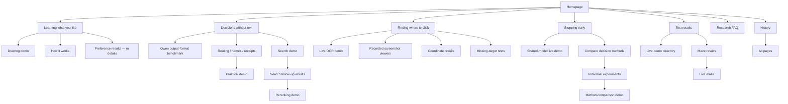
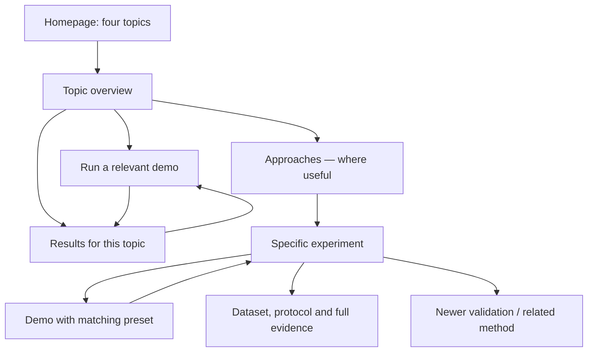

# Navigation audit

The findings below describe the **before** snapshot: commit `a915d52` plus the menu cleanup. The [before inventory](../results/navigation-audit/before.json) preserves that state. This is a local audit, not a production crawl.

The approved workflow has now been implemented. The [interactive map](navigation-map.html) and [current inventory](navigation-map.json) show the current site, including mode-specific links. Demos now retain their chosen mode, link to the matching study, and provide a route back from that study. The sitemap is complete, and the missing preference, screenshot, maze and task-result connections are repaired. Two focused browser-result pages separate actual browser evidence from related Python/Qwen studies. Wider viewer/search-page mergers remain optional follow-up work.

**The main problem is missing context between pages, not an inability to reach them.** A visitor can reach every page, but often has to go back through a general listing to find the relevant experiment, newer evidence, or another version of the same demo.

Open [the interactive map](navigation-map.html). Select any page to see its incoming links, outgoing links, shortest route from home, and every individual destination. The [JSON inventory](navigation-map.json) preserves labels, query modes, fragments, collapsed links, and external/evidence destinations.

## Before the workflow changes

- 68 current pages, 1,731 anchor links, and 299 distinct connections within page content.
- The shared header, sidebar, and footer are separate from content connections. Including them increases the graph to 958 connections and makes weak content paths look healthier than they are.
- All 68 pages are reachable from homepage content if the visitor is allowed to use **All pages**. Seven require that detour in the content graph. About is also directly available in the shared menu, so this is not a claim that it is hidden.
- 15 pages repeat at least one identical page destination in their content. Some repeats are useful; a comparison table and a method explanation can legitimately link to the same study.
- The **All pages** listing itself omits 12 current pages. They remain reachable through other routes.
- Historical pages, raw evidence, source files and external sites are recorded as destinations, not recursively crawled. Downloads and model execution are not page navigation.

Reproduce with `python scripts/audit_navigation.py`. Each mapped HTML file has a SHA-256 in the inventory. The audit uses the generated pages, including template-backed demos, rather than assuming the content registry is the rendered site.

## Current routes from the homepage

These are selected real paths. The interactive map contains every connection; this diagram deliberately omits cross-links and technical sources for readability.

The shared menu separately exposes Home, FAQ, Results, the four topics, Live demos, History, About and All pages from every current page. A cross-link is not automatically a second category: the same research can legitimately be reached through a task and through a method.

## Missing or misleading connections

| Priority | Current path / gap | Recommended fix |
|---|---|---|
| High | `depth-results` → `method-demo?method=fixed`. The demo's only content link to another current page is **All live demos**. The same problem affects adaptive, cascade, training and quantization modes. | Show **About this approach** and **Recorded results** for the selected mode. Keep the BERT/Qwen distinction next to these links. Do not send visitors to a general results listing. |
| High | `prefix-results`, `batch-results`, `combined-results` → `execution-demo`. None has a direct return from that demo. | Switch the explanation/results links with the selected Qwen execution mode. Link the three related methods to one another. |
| High | Routing, names and receipt pages → `practical-demo?task=…` → only **All live demos**. | Each task selection should expose its own study and parent topic. |
| High | `coordinate-results` contains the 30-screenshot findings but links to the six-local-target viewer. It does not link to the matching 30-screenshot viewer or the harder follow-up. | Link directly to `screenshot-demo` and `visual-refusal-results`, with dataset/sample labels. Keep the six-target pilot as an earlier test. |
| High | `coordinate-lab` → **About this test** → `results.html#coordinates`, a category listing. | Point to the exact local-pilot evidence (`docs/coordinate-abstention-smoke.md` / `results/coordinates/result.json`) or a clearly labelled local-test section. The 30-screenshot report is a related study, not interchangeable evidence. |
| High | `maze-results` → `maze-live` → older Qwen recordings or the demo directory. | Add a return to `maze-results`, which explains the policy actually running. The older failed Qwen run stays secondary. |
| Medium | Active learning has only one incoming content link: **All pages**. The preferences topic and its results do not link to it. | Add **Which example should come next?** to the preference explanation/results; link the preference-method demo back to both active learning and multiple styles. |
| Medium | `decision-results` links older studies, but not `fresh-message-results` or `quantization-results` directly. The fresh validation is prominent in the FAQ instead. | Give the method comparison a short **Latest checks** section. Keep the old samples labelled and separate. A FAQ should not be the clearest route to newer evidence. |
| Medium | `results.html` lists preference, decisions, coordinates and maze results. Search and the three practical task studies have no direct entry. | Add a small task grouping with search, routing, names and receipts. A results index should cover the current research without forcing a trip through a demo first. |
| Medium | The demo directory omits `tiny-decision-demo`, although the decisions topic and FAQ link to it. | Include it under message classification, or deliberately replace that entry point after comparing its features with the method lab. Do not leave it accidentally undiscoverable from the demo list. |
| Medium | The older `browser-benchmark` has no content link to another current page. It only points to technical documentation/source plus shared navigation. | Label it **Earlier three-message example** and link to the real-message benchmark and the decisions topic. |
| Medium | `shared-model-results` and `shared-qwen-results` both say **Back to decisions without text**, even when reached through stopping early. | Give each study a stable topic/method breadcrumb. Use **Related topic** for a second valid parent rather than implying where the visitor came from. |
| Medium | **All pages** omits 12 current pages and duplicates the shared-model entry. | Generate its current-page list from the same page registry as the builder; group it by topic and separate the historical material. |

The 12 sitemap omissions are: `results-record`, `search-next-results`, `quantization-results`, `fresh-message-results`, `visual-refusal-results`, `method-demo`, `practical-demo`, `execution-demo`, `maze-live`, `point-demo`, `rerank-demo`, and `preference-method-demo` (all `.html`).

The seven pages requiring the sitemap in a content-only route are About, active learning, related research, future explorations, roadmap, investment analysis and investment response. The homepage's only incoming **content** link is also from the sitemap, but every page has the home wordmark: that is expected, not a defect.

## Redundancy and consolidation

| Pages / elements | Assessment | Suggested treatment |
|---|---|---|
| `getting-started` and `demo-directory` | Both introduce demos, but getting started also contains useful developer instructions. | Make the directory the visitor entry. Retitle getting started **Run the code locally** and link it from technical material. Keep its URL working. |
| `future-explorations` and `roadmap` | Both are short status/proposal pages with the same next-step links. | Fold their distinct text into a **Next questions** section in the FAQ. Preserve historical links and old URLs. |
| `examples/index` and its five application pages | The index lists all five examples twice; individual pages are proposals, not working app demos. | Remove the duplicated list. Consider one compact **Possible applications** page with five anchored sections and a clear proposal label. |
| `coordinate-lab` and `screenshot-demo` | Both browse saved GUI-Actor points, but use different datasets. The local workbench also has a manual annotation tool. | A shared **Recorded screenshot tests** viewer could offer separate datasets; keep annotation as an optional tool. Preserve the records and limits, not duplicate surrounding explanations. |
| `search-demo` and `rerank-demo` | Both query the same paper collection, with different ranking paths. The user journey unnecessarily crosses multiple pages. | One **Search papers** demo with keyword, meaning and reranking options is a reasonable consolidation. Keep original and follow-up evaluation sets distinguishable. |
| `shared-decision-demo` and adaptive mode in `method-demo` | Both expose the same four-layer family and shared two-layer exit, with different comparison controls. | Choose one primary **Run early stopping** entry. Reuse the underlying runner or link to the relevant preset. Keep the simpler experience unless a feature check shows the general lab is equally clear. |
| `browser-benchmark` and `moderation-benchmark` | Similar output-format theme; three authored banking requests versus real moderation messages. | Promote the real-data benchmark. Keep the older example as a labelled reference, rather than another equal demo entry. |
| `cascade-results` and `cascade-test-results` | Useful split: a short explanation versus detailed rows and timings. | Keep this split. It already supplies an exact result destination; copying the 100-row table into the overview would add noise. |
| Qwen studies and BERT browser demos | A similar method is not the same implementation or experiment. | Link them explicitly, but do not collapse their evidence into a shared claim. |
| `point-demo`, `image-action-demo`, and recorded GUI-Actor viewers | OCR text matching, synthetic-arrow inference, and real screenshot records are different capabilities. | Group under the coordinate topic, labelled **Live OCR**, **Live arrow model**, and **Recorded vision-model tests**. Do not present them as interchangeable demos. |

Repeated links worth trimming first: three drawing-demo links on `how-it-works`, two replay links with different names on `coordinates`, two identical comparison destinations on `adaptive`, and the duplicated application list. A primary demo button plus a contextual link near results may still be helpful; duplicate counts alone are not a deletion rule.

## Proposed navigation pattern

Keep the four homepage topics and the approved visual style. Improve the hierarchy and local connections before adding more top-level navigation.

Each experiment needs three obvious destinations: **Run the demo**, **See the recorded results**, and **Back to the approach**. A demo should retain its selected mode in the URL and display the corresponding explanation and evidence links. Use a stable mapping, not browser history or referrer guesses.

Keep separate discovery routes with different jobs:

- **Topics:** explain the problem and show a small number of representative examples.
- **Live demos:** group runnable experiences by task; distinguish recordings as references.
- **Test results:** browse measured studies, with dataset, model and sample size visible.
- **Research FAQ:** answer questions and link to those canonical pages; avoid treating it as a second results index.
- **All pages:** exhaustive fallback, generated automatically.

Do not put caching, batching and quantization under a label that implies they stop layers early. They can sit beside early stopping under **Ways to reduce computation**, while **Stopping early** remains a specific topic. Likewise, direct label output is distinct from early exit even when a demo combines the two.

## Suggested implementation order

1. **Repair the paths:** exact evidence links, demo-to-study links, matching screenshot sample, maze return path, active-learning discovery and the missing sitemap entries. Preserve existing URLs and content.
2. **Reduce repeated menus:** remove redundant calls to action, group demos and results, give each page one canonical parent and a short related-links row.
3. **Consolidate only after comparing features:** roadmap/future pages, proposal pages, screenshot viewers and search demos. Preserve old URLs/fragments as aliases or explicit onward links. Keep distinct datasets and model implementations separate.
4. **Check real journeys:** homepage → topic → chosen method → correctly selected demo → that method's results, on mobile and desktop; repeat from a direct deep link. Confirm no journey requires the global sitemap or browser Back to find its own evidence.

## Validation and limits

The interactive map is a source-derived navigation audit, not analytics or a usability study. Link count measures available choices, not how confusing people find them. The initial audit did not modify public pages; the subsequently approved workflow does. Remaining page-consolidation proposals require a feature comparison before implementation.

The map's page/zone/closed-details extraction is checked against browser DOMs. Its controls, hash navigation, all-page selector, relative source links and mobile layout are checked separately. The static site link check verifies file destinations; this audit additionally inspects content paths and cross-page relationships.
